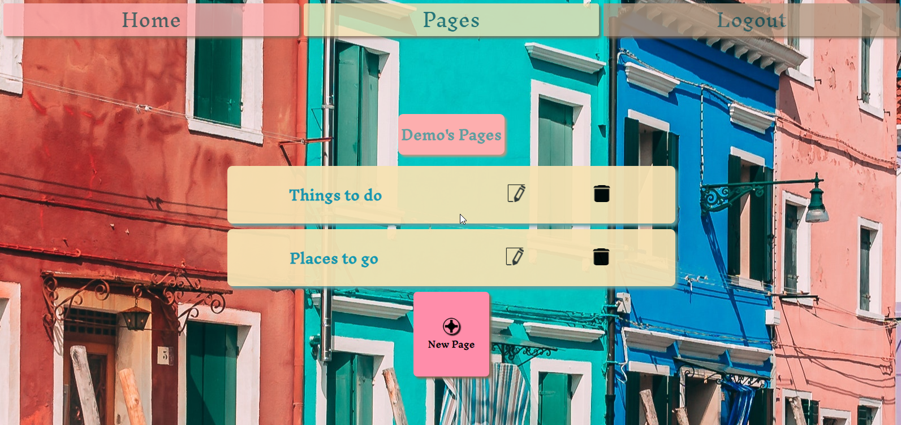

<p align='center'>
  
</p>

# Naples
Naples is a todo-list / note-taking application that allows user to organize and keep track of the things that are most important to them. It is a fullstack React App made with a Redux state manager and a backend using Javascript, Python, Flask, SQL-Alchemy, Heroku and PostgresSQL.

* View the <a href='https://naples-app.herokuapp.com/'>Naples</a> App Live

* Reference to the Naples <a href='https://github.com/Omstachu/naples/wiki'>Wiki Docs</a>

| Table of Contents |
| ----------------- |
| 1. [Features](#features) |
| 2. [Installation](#installation) |
| 3. [Technical Implementation Details](#technical-implementation-details) |
| 4. [Future Features](#future-features) |
| 5. [Contact](#contact) |
| 6. [Special Thanks](#special-thanks) |


## Technologies
* <a href="https://developer.mozilla.org/en-US/docs/Web/JavaScript"></a>
* <a href="https://www.postgresql.org/"></a>
* <a href="https://nodejs.org/"></a>
* <a href="https://reactjs.org/"></a>
* <a href="https://redux.js.org/"></a>
* <a href="https://developer.mozilla.org/en-US/docs/Web/CSS"></a>
* <a href="https://www.python.org/"></a>
* <a href="https://flask.palletsprojects.com/"></a>
* <a href="https://www.heroku.com/home"></a>


## Features

### Sign In and Sign Up
## Sign Up

## Sign In


### Pages
Display all available lists that you've created and allows you to make as many extra lists as you would like.<br>
Allows you to Edit the names of your Pages, and delete any Pages you no longer have any use for.


### Lists
Here you can Edit, Delete, and Create up to 4 different Lists per Page. <br>
By having some "cost" associated with the value of space for the Lists you have, the intent is to force user to put more thought into the organizational framework of their notes instead of recklessly diluting their structure with uncapped list-making.


### Items
Here the user is able to create, edit, and remove items on their lists.


## Installation
To build/run project locally, please follow these steps:

1. Clone this repository

```shell
git clone https://github.com/Omstachu/naples.git
```

2. Install Pipfile dependencies and create the virtual environment
```shell
pipenv install
```

2. Install npm dependencies for the `/react-app`

```shell
cd react-app
npm install
```

3. In the `/` root directory, create a `.env` based on the `.env.example` with proper settings

4. Setup your PostgreSQL user, password and database and ensure it matches your `.env` file

5. Before running any flask commands, confirm you are in the pipenv virtual env. If not, run the command:
```shell
pipenv shell
```

5. In the root folder, create the database by running in the terminal:
```shell
flask db create
```

6. In the root folder, migrate tables to the database by running in the terminal:
```shell
flask db migrate
```

7. In the root folder, seed the database by running in the terminal:
```shell
flask seed all
```

8. Start the flask backend in the `/` root directory
```shell
flask run
```

9. Start the frontend in the `/react-app` directory

```javascript
npm start
```


## Technical Implementation Details
This is one of my favorite moments in making this project. <br> Using a predefined array and string interpolation, each List received from the backend was assigned a class corresponding to the quadrant it should exist in on the user's screen.<br> Because the Lists are being dynamically iterated through, this also means that when the user deletes a List, the page will readjust the positions of each List by reassigning it's quadrant.

### CSS for Quadrant styling


## Future Features

1. __Back Button__ - Allowing the user to easily navigate through the site without having to resort to the default browser button. Additionally it would allow a better user experience on mobile devices.

2. __Timestamps__ - Adding timestamps to when an item is create or edited should help with understanding the context of why you may have added a certain item.


## Contact

### Brandon Simpson
<a href="https://www.linkedin.com/in/brandon-simpson-5617ab212/">Linked In</a><br>
<a href="https://github.com/Omstachu">GitHub</a><br>
Email: omstachu626@gmail.com


## Special Thanks
* People who have provided me with invaluable wisdom, support, and companionship: [Ji](https://github.com/ji-k), [Michelle](https://github.com/michellekontoff),[Johnathan](https://github.com/jyih),[Pierre](https://github.com/TheGuilbotine), [Nico](https://github.com/nicopierson) ,
* Mentors who have given me their time and effort: [Rihana](https://github.com/martinson-r) [Ed](https://github.com/edherm), and [Javier](https://github.com/javiermortiz)
